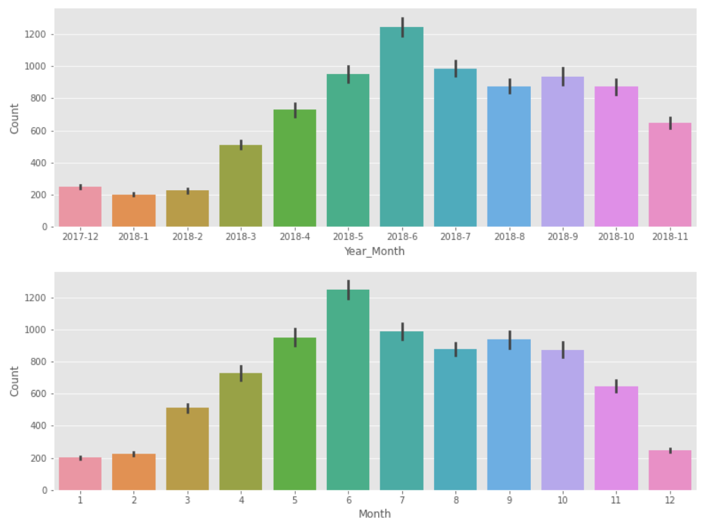
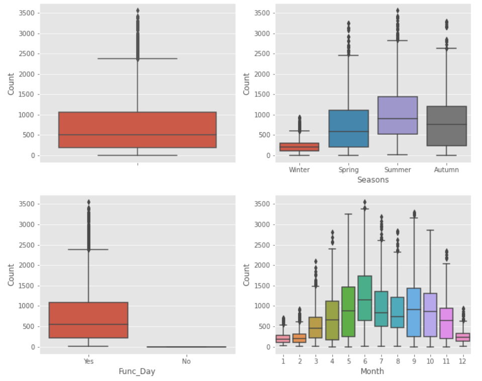
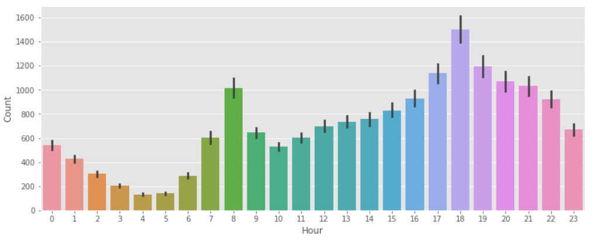
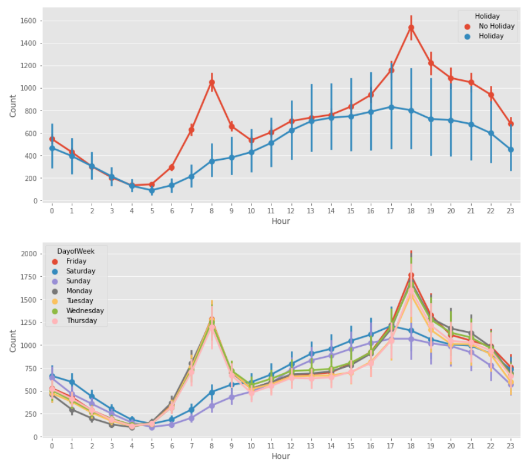

# Data preparation and exploration

The Seoul Bike Data and it consists of 8760 rows and 14 columns (variables). 

The 14 original variables are: 
*	**Date**: The day of the day in the year  
*	**Rented Bike Count**: Number of rented bikes per hour
*	**Hour**: The hour of the day
*	**Temperature (°C)**: Temperature per hour
*	**Humidity (%)**: Humidity in the air in %
*	**Wind speed (m/s)**: Speed of the wind in m/s
*	**Visibility (10m)**: Visibility in m
*	**Dew point temperature (°C)**: Temperature at the beginning of the day
*	**Solar Radiation (MJ/m2)**: Sun contribution
*	**Rainfall (mm)**: Amount of rain in mm
*	**Snowfall (cm)**: Amount of snow in cm
*	**Seasons**: Season of the year (4 seasons)
*	**Holiday**: If it is a holiday period
*	**Functioning Day**: Whether it is a Functioning Day

With the Seoul Bike dataset loaded, the first work done was looking into the column names. The columns that were too long 
or included symbols were cleaned and made shorter. This would make it easier to call them later when more work would be done 
in looking into the dataset. Then the missing values were checked. This particular dataset had no missing values, so the data 
type of each column was looked into next. The Date columns were saved as an object hence it was changed to date type data. 
Then some more columns were created using the date columns, as we wanted to see and understand the data more deeply: Year, 
Month, Day, DayofWeek, and Year_Month columns (variables) were created. Lastly, a new column Night_Day was added, where 6, 
typically when people wake up to get ready to work, till 18, when people get off work, was considered daytime. This new 
column was added as I believe it would be able to show more insights into bike renting behavior with the time of the day. 

Each of the new columns (variables) represents: 
*	**Year**: The year of the data.
*	**Month**: The month of the data.
*	**Day**: The day of the data. 
*	**DayofWeek**: What day of the week the data is for. 
*	**Year_Month**: The year and month are concatenated, and the day of the date is eliminated. 
*   **Day_Night**: Whether it is day-time or night-time.

Then without changing the data further I decided to investigate how many data were from 2017 and how many were from 2018. 
There are 744 data for 2017 and 8016 for 2018. When plotted in a bar chart using Year_Month, it’s clear that for 2017 we 
have fewer data because the data from 2017 are for December which 2018 lacks. A very similar bar graphed is plotted right 
below this time with Month Vs. Count, and it is the same as the one above just that the 2017 December data was put at the 
back. Through this bar graph, we can know that June and other hotter months have more bikes rented and colder months have 
relatively fewer bikes rented. 

The box plots were graphed to see the outliers and to understand the number of bikes rented for different variables. 
The boxplots show that the number of bikes rented data, which is the Count variable, would be skewed to the right. From 
the boxplot plotted for seasons, we can infer that summer is the season with the most bike rented as the mean is the highest, 
which collaborates with the finding we had previously with the Month Vs. Count bar graph. Another important point here with 
the boxplots is that all data are from when the bike renting system was functioning, hence the Function Day variable isn’t 
going to provide any insights. 

Then a bar graph was made with the number of bikes rented to the hour of the day. There are two peaks in the number of 
bikes rented in the day. The two peaks occur at 8 when people usually go to work and 18 (6 pm) when work usually ends 
and the bike would be returned. 

Then with a similar idea, two-point plots were created for the number of bikes rented for each hour, but how they differ 
for different variables. The first one shows how it is for days that are holiday and days that aren’t holidays, and the 
second one show for each day of the week. The interesting insight gained from these two graphs was that the graphs show 
a similar pattern for Weekdays and Not Holiday, and the Weekend data and the Holiday data have similar patterns. I was 
curious if this was because during the Holiday a greater number of bikes were rented on Sunday and Saturday, and vice 
versa. Yet looking at the pivotal table (can be seen in the code section) that doesn’t seem to be the case. Hence, we 
can know that the graph shows that the users of the bike renting system tend to use the bike renting system in similar 
behavior on holidays and on the weekends. 

Then the data with numerical variables such as Temperature and Visibility was looked at in their statistical description. 
A correlation map was created as well to just get an idea of how each of them correlated to each other and count. The Dew 
Temperature (DPtemp) and Temperature (Temp) variables have a very strong correlation of 0.91. 

Before saving the new modified data, final touches were made as more insights from the data were found through the data 
exploration. The Function Day (Func_Day) and Dew point Temperature (DP_Temp) were dropped. The Function Day as found out 
previously in the box plot was shown to have no impact on the number of bikes rented so it was eliminated. The Dew Point 
Temperature variable is the temperature of the morning with hyper correlation with the Temperature variable, so it doesn’t 
seem necessary to have. Hence, after all the final touches the data was saved as "df_prepared.csv".

